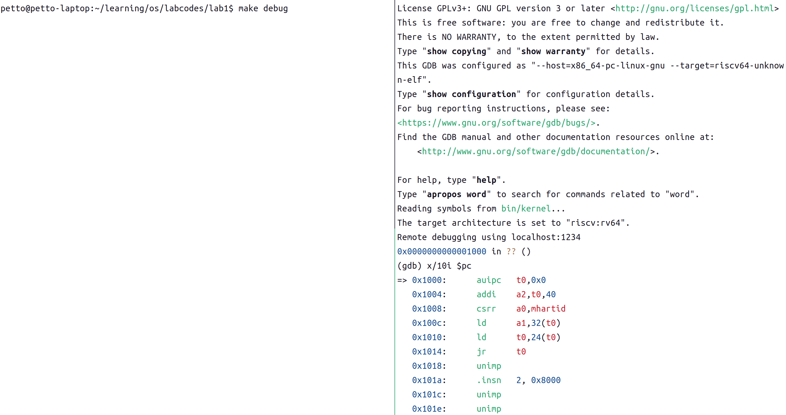
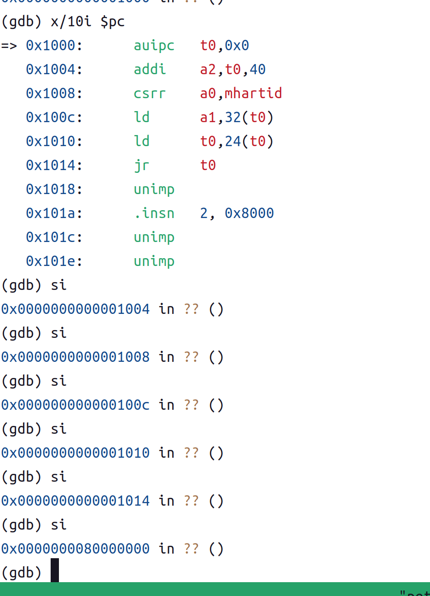
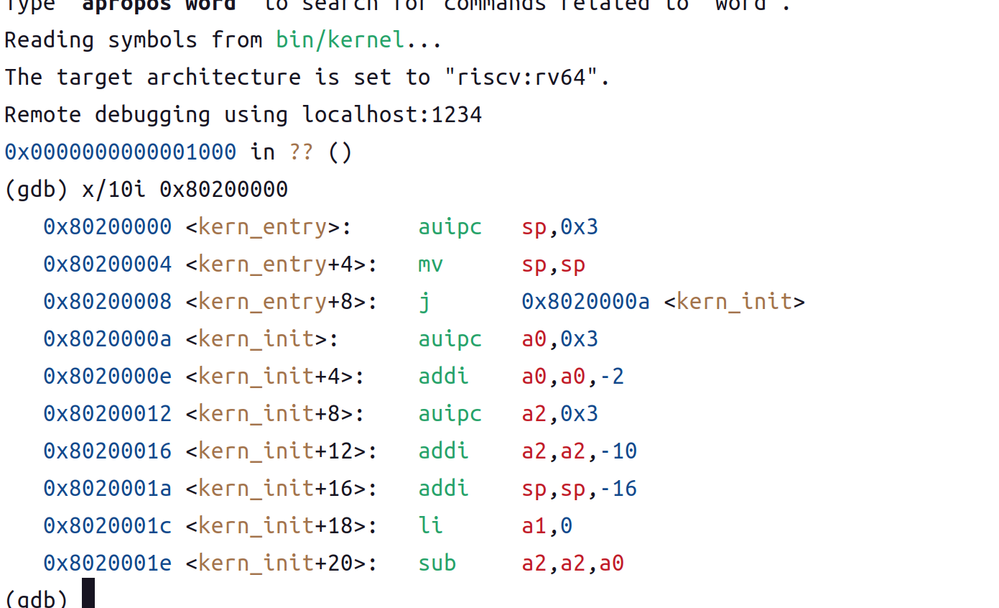
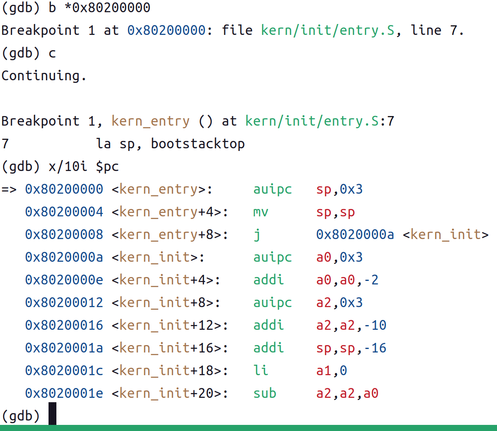

# lab1: 比麻雀更小的麻雀（最小可执行内核）

> 小组成员：谢雨婷 2311623 李天一 2314018 邓鑫 2313982

## 实验目的

- 使用 链接脚本 描述内存布局

- 进行 交叉编译 生成可执行文件，进而生成内核镜像

- 使用 OpenSBI 作为 bootloader 加载内核镜像，并使用 Qemu 进行模拟

- 使用 OpenSBI 提供的服务，在屏幕上格式化打印字符串用于以后调试

## 实验内容

实验 1 主要讲解最小可执行内核和启动流程。我们的内核主要在 Qemu 模拟器上运行，它可以模拟一台 64 位 RISC-V 计算机。为了让我们的内核能够正确对接到 Qemu 模拟器上，需要了解 Qemu 模拟器的启动流程，还需要一些程序内存布局和编译流程（特别是链接）相关知识,以及通过 opensbi 固件来通过服务。

## 练习

### 练习 1：理解内核启动中的程序入口操作

阅读 kern/init/entry.S 内容代码，结合操作系统内核启动流程，说明指令 la sp, bootstacktop 完成了什么操作，目的是什么？ tail kern_init 完成了什么操作，目的是什么？

1. `la sp ,bootstacktop`，这条指令将 bootstacktop 这个符号的地址加载到 sp(stack pointer)寄存器中。在数据段中定义了一块用于内核启动的栈空间(bootstack),所以这条指令是设置内核的初始栈指针 sp,让它指向 bootstack 这块内存区域的顶部。设置该指令的目的是为即将开始执行的 c 代码（kern_init）创建一个有效的栈空间。（c 语言函数在执行的时候 需要使用栈来保存局部变量、函数参数、返回地址等信息。）
2. `tail kern_init ` 是一条尾调用指令，它会无条件地跳转到 kern_init 函数的地址去执行。设置该指令的目的是将 cpu 的控制权从汇编代码 kern_entry 永久的传给 kern_initc 语言函数。

### 练习 2: 使用 GDB 验证启动流程

为了熟悉使用 QEMU 和 GDB 的调试方法，请使用 GDB 跟踪 QEMU 模拟的 RISC-V 从加电开始，直到执行内核第一条指令（跳转到 0x80200000）的整个过程。

#### 调试过程

1. 使用命令 make debug 打开 qemu,make gdb 启动 gdb 连接到 qemu1234 端口

2. 首先 pc 指向 0x1000， 反汇编当前指令
   输入`x/10i $pc`。观察到的指令如下:
   
   即：

   ```asm
   0x1000: auipc t0,0x0 # t0 = PC + 0x0 << 12 = 0x1000
   0x1004: addi a2,t0,40 # a2 = 0x1000 + 40 = 0x1028
   0x1008: csrr a0,mhartid # 取硬件线程号
   0x100c: ld a1,32(t0) # a1 = _(0x1000+32) = _(0x1020)
   0x1010: ld t0,24(t0) # t0 = _(0x1000+24) = _(0x1018)
   0x1014: jr t0 # 跳转到 t0
   ```

   0x1000 附近的几条指令是固件启动“引导 stub”，主要作用是：
   建立 hartid 参数、加载启动参数表，然后跳到 OpenSBI 主逻辑。

3.单步执行`si`,发现从 pc 从 0x1014 跳转到了 0x80000000，即 opensbi 的地址。


4.内核的加载

一开始就已经被 qemu 预加载到指定位置了

5.设置断点，0x80200000,在控制权转移到内核的瞬间中断下来,看到内核的第一条汇编指令


#### 问题

**RISC-V 硬件加电后最初执行的几条指令位于什么地址？它们主要完成了哪些功能？**

RISC-V 硬件加电后最初执行的指令位于物理地址 0x1000。他们的功能是为跳转到 Opensbi 固件做准备（获取当前 cpu 核心的 id 参数 a0,设备树的地址参数 a1,opensbi 的入口地址保存到 t0 寄存器），并最终跳转到 opensbi 的执行地址中，

## 本实验中重要的知识点

### 系统的启动流程

| 实验中重要的知识点                                                                                                                                            | 对应的原理知识点             | 理解                                                                                                                                                                     |
| :------------------------------------------------------------------------------------------------------------------------------------------------------------ | :--------------------------- | :----------------------------------------------------------------------------------------------------------------------------------------------------------------------- |
| 最小系统的启动流程：从硬件上电->从 0x1000 开始执行->跳转到 opensbi(0x80000000)->opensbi 初始化并加载内核到 0x80200000->跳转到内核（0x80200000）->内核开始执行 | OS 启动过程（Bootstraaping） | 实验展示了一个具体的操作系统的启动流程。（risc-v）。os 启动是从固件接收控制权，并完成硬件环境配置的过程。不同体系结构有不同的启动流程(x86 架构的 bios)                   |
| 链接脚本与内存布局                                                                                                                                            | 程序加载与执行环境，内存管理 | 链接脚本是实现 OS 内存布局的技术手段。它定义了程序各个部分在物理内存中的位置和大小。实验只涉及静态加载到预定的物理地址，没有涉及动态内存分配，虚拟地址与分页机制         |
| 交叉编译 工具链（risc-v gcc,ld）使用交叉编译器声称目标架构的 elf ,链接生成 bin/kernel，再 objcopy 生成二进制镜像                                              | 构建系统与可执行文件格式     | 交叉编译将宿主机代码转换为目标架构(risc-v)的可执行镜像。os 需要一套工具链来创建自身。这是实验技术上的内容，原理关注的是最终生成的 elf 文件格式及其再内存中的映射。       |
| gdb 调试跟踪                                                                                                                                                  | 系统调试与故障排除           | 这是开发方法，不是 os 原理本身。gdb 是实现 os 调试的必备工具。os 开发复杂，断点、单步、寄存器查看是理解系统状态和启动流程的有效手段                                      |
| opensbi 服务调用                                                                                                                                              | 固件/BIOS 抽象层             | sbi 是 risc-v 架构下内核与固件/硬件教交互的标准接口。os 通过固件服务（如屏幕打印）来抽象底层硬件细节。sbi 提供了一个统一、安全的接口规范，降低了 os 开发对具体硬件的依赖 |
| 设置初始栈指针(`la sp,bootstacktop`)                                                                                                                          | 执行环境与栈帧管理           | 栈是 c 函数调用和局部变量存储的基础。os 必须在进入 c 语言环境前设置好                                                                                                    |
| qemu 与设备加载                                                                                                                                               | 虚拟化/模拟化 设备抽象       | qemu 提供硬件语义(如串口)方便在没有真实硬件下验证内核，但模拟与真实的仍是存在不同的                                                                                      |

## OS 原理中很重要，但实验中没有对应上的知识点。

1. hart 的理解。
   **Har**dware **T**hread：RISC-V 架构中执行指令的基本单元。一个可以独立执行指令流的硬件线程。每个 hart 都有自己的程序计数器(PC) 和寄存器文。可以理解为执行上下文或逻辑处理器

2. 硬件信息的传递（设备树解析）：这里的 参数 a1。OpenSBI 会将设备树的地址传递给内核，内核需要解析设备树来获取内存布局、外设信息等。实验中没有涉及设备树的解析。
3. 设备/外设初始化
   OpenSBI 在引导时通常会做一些设备初始化，比如定时器、串口。实验里我们没有深入看这些初始化动作，只用到了打印功能。
