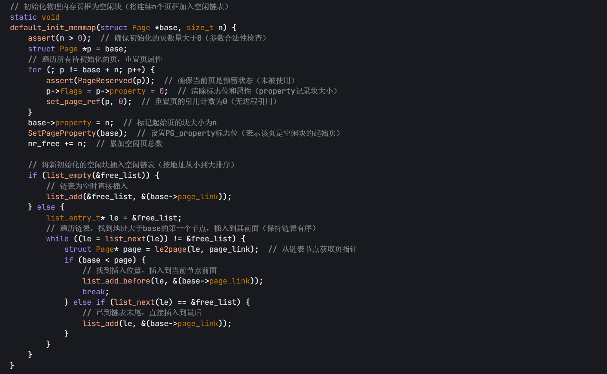
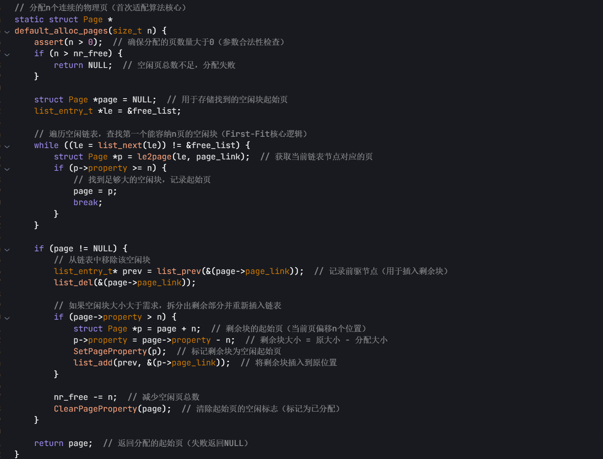
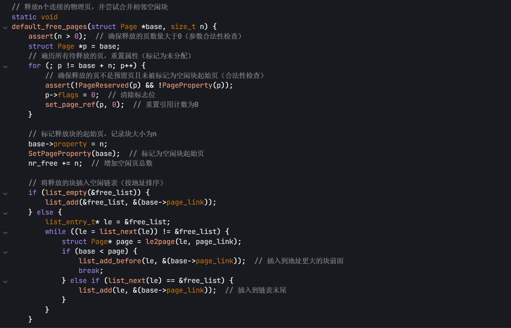
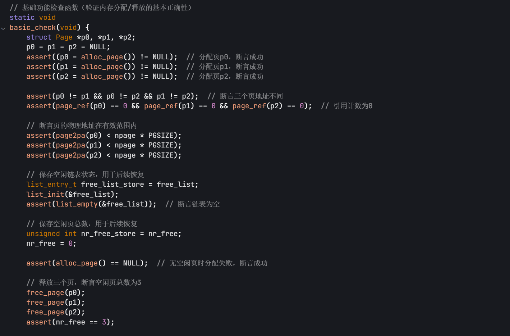
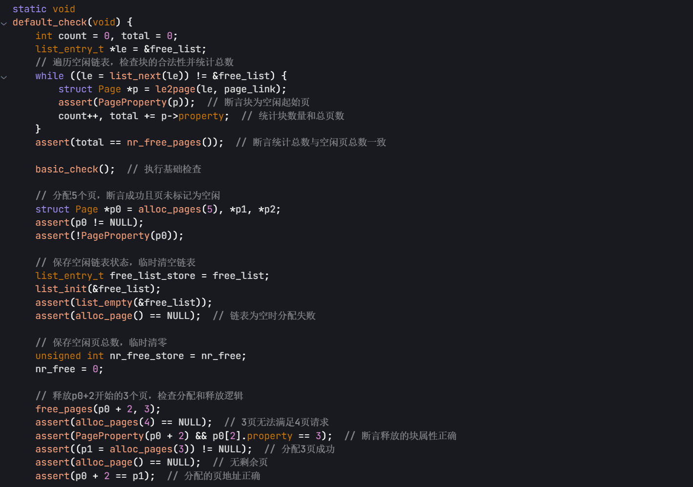
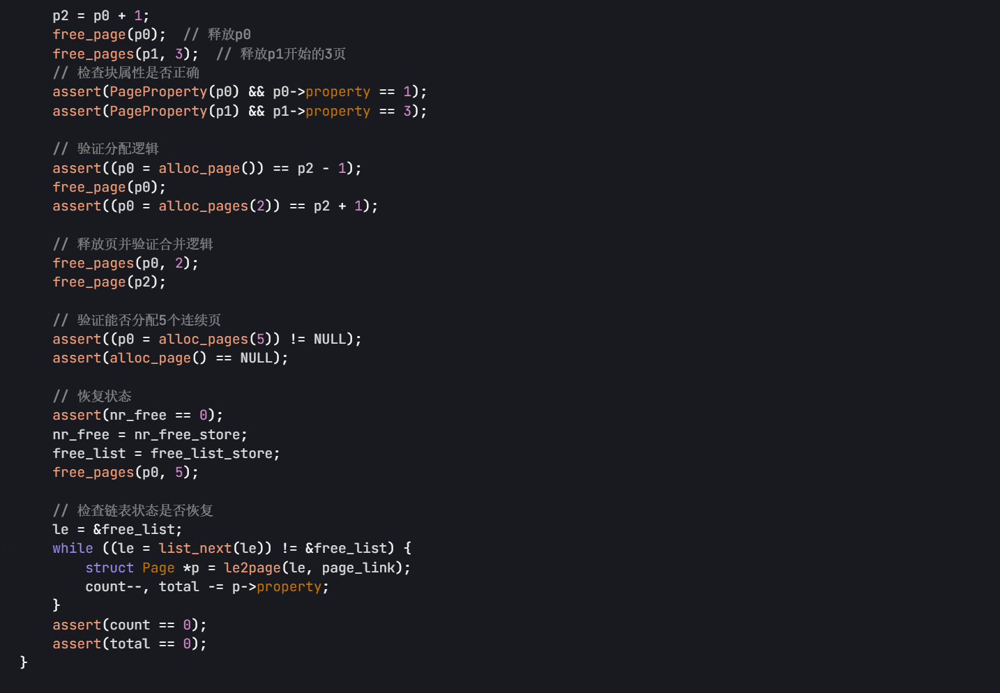
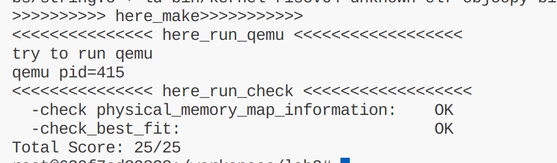
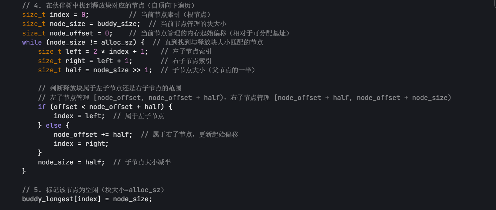
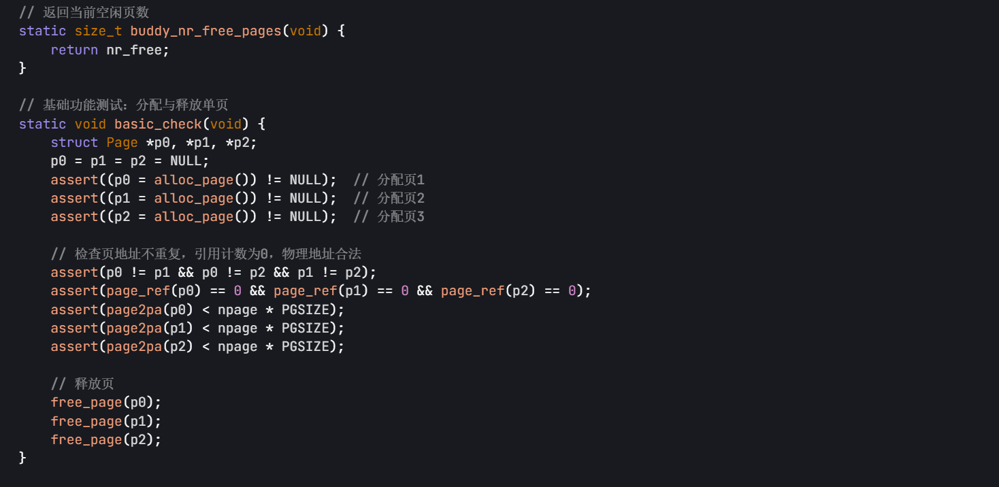
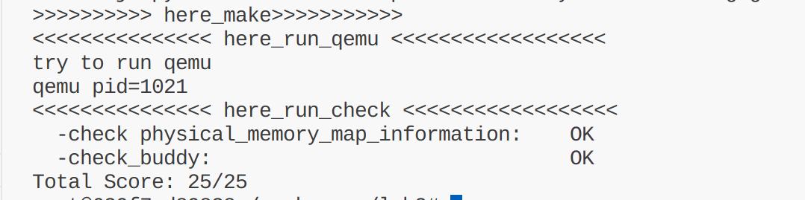

# 实验二：物理内存管理

> 小组成员：谢雨婷 2311623 李天一 2314018 邓鑫 2313982

## 练习 1：理解 first-fit 连续物理内存分配算法（思考题）

### 分析函数

#### `defalut_init`函数

#### `default_init_memmap`

该函数用来用于初始化物理内存页框为空闲块，传入两个参数：要存的地址基址和页数。首先需要初始化在这个空闲块中的每一页，每一页的 property （属性值）和 flags（标志位） 和 ref（引用） 变量都为 0。设置第一个页（base）的 property 为 n，表示这个空闲块的大小为 n 个页，并设置 base 页的 PG_property 标志位（表示这个页是一个空闲块的第一页，并且该空闲块的大小为 property）。然后，全局空闲页计数 nr_free 增加 n。

- 具体做法：将一个空闲内存块插入到空闲链表中，若空闲链表为空，直接将该内存块插入到链表中。若链表不为空，遍历链表，从 free_list 开始一直循环遍历到再次回到起点 free_list,将当前链表指针转化为 page 结构指针（利用 c 结构体内存连续分布的性质），与要插入的 base 比较，若 base 小于 page,则将 base 插入当前 page 节点之前，使用`list_add_before(le,&(base->page_link))`;若到了最后一个节点，则将 base 节点插入链表末尾（即 free_list 之前，le 之后）。

#### `default_alloc_pages`

该函数用于分配 n 个连续的物理页。找到第一个满足条件的空闲块并重新调整空闲块返回指向分配的空闲块空间的指针。该函数的实现步骤：

1. 看 n 是否大于 0 确保至少分配一页,并检查是否有足够的空闲页
2. 遍历空闲链表，并找到第一个满足条件的空闲块（块大小>=n）。
3. 若找到这样的块，则将其从空闲链表中移除。
4. 若该块的页数大于 n,则分割这个块：计算分割后剩余块的起始页，page+n;设置剩余块的大小为原大小减去 n，设置剩余块的 property 标志位，表示它是一个空闲块的开始。将剩余部分重新加入链表。
5. 更新空闲页数量并清除分配块的 property 标志。
6. 最后返回指向分配的页的指针。
   

#### `default_free_pages`

释放 n 个连续的物理页，并尝试合并相邻空闲块

- 将要释放的页的标记和引用清空为 0,设置头部的属性标志，并将属性设置为 n,同时更新空闲页数量
- 将该块加入空闲链表的方法与之前的`default_init_memmap`如出一辙
- 接下来是看是否可以合并，分为前向合并与后向合并。
  
  

#### `Basic_check`

验证内存分配与释放的基本正确性.

#### `Default_check`

用于检查首次适配分配算法

### 描述流程

在函数的分析中已经描述了流程，这里不再赘述。

### 问题 first fit 算法是否有进一步的改进空间？

**是的，first fit 算法确实有进一步的改进空间：**

1. **外部碎片问题**：First fit 算法容易产生外部碎片，特别是在频繁分配和释放不同大小的内存块时。虽然代码中实现了相邻空闲块的合并机制，但仍可能产生大量小碎片。

2. **分配效率优化**：

   - 当前实现需要遍历整个空闲链表直到找到第一个合适的块，时间复杂度为 O(n)
   - 可以考虑按大小分类管理空闲块，使用多个链表分别管理不同大小的空闲块
   - 或者使用平衡树等数据结构来加速查找过程

3. **内存利用率提升**：

   - 当前算法总是选择第一个满足条件的块，可能不是最优选择
   - 可以考虑实现 next fit 算法，从上次分配的位置开始搜索，减少小碎片在链表前端的积累
   - 或者实现 worst fit 算法，选择最大的可用块，为后续分配留下更多选择

4. **缓存友好性**：

   - 当前实现按地址顺序维护链表，可能不是最缓存友好的方式
   - 可以考虑按访问频率或大小重新组织数据结构

5. **并发安全性**：
   - 当前实现没有考虑多线程环境下的并发访问
   - 需要添加适当的锁机制来保证线程安全

## 练习 2：实现 Best-Fit 连续物理内存分配算法（需要编程）

在完成练习一后，参考 kern/mm/default_pmm.c 对 First Fit 算法的实现，编程实现 Best Fit 页面分配算法，算法的时空复杂度不做要求，能通过测试即可。
请在实验报告中简要说明你的设计实现过程，阐述代码是如何对物理内存进行分配和释放，并回答如下问题：

### 设计实现过程

与 first fit 算法类似，不同的点在于分配内存的实现上。best fit 算法需要遍历整个链表找到 property >= n 且 property 最小的块。使用变量 min_size 记录当前找到的最小连续空闲页框数量。如果块大于需求，也是使用跟 first fit 算法一样的方法，分割块，剩余部分重新加入链表。

### 测试结果

### 问题 你的 Best-Fit 算法是否有进一步的改进空间？

**是的，Best-Fit 算法也有进一步的改进空间：**

1. **时间复杂度问题**：

   - 当前实现需要遍历整个空闲链表来找到最小的合适块，时间复杂度为 O(n)
   - 可以考虑使用平衡树（如红黑树、AVL 树）或堆数据结构来维护按大小排序的空闲块
   - 这样可以将查找时间降低到 O(log n)

2. **内存碎片优化**：

   - Best-Fit 虽然减少了内部碎片，但仍可能产生大量小外部碎片
   - 可以考虑实现更智能的碎片整理策略，定期合并小碎片
   - 或者实现分离存储（segregated storage），为不同大小的请求维护不同的空闲块池

3. **分配策略改进**：

   - 当前算法总是选择最小的合适块，但这可能导致剩余部分过小
   - 可以考虑设置阈值，当剩余部分小于某个值时，直接分配整个块而不分割
   - 或者实现"近似最佳适应"策略，在效率和碎片之间找到平衡

4. **数据结构优化**：

   - 当前使用双向链表，插入和删除操作相对简单但查找效率不高
   - 可以考虑使用更高效的数据结构，如：
     - 按大小排序的平衡树
     - 按地址排序的平衡树（用于合并相邻块）
     - 分离的空闲块池（按大小分类）

5. **缓存性能优化**：

   - 当前实现按地址顺序维护链表，可能不是最缓存友好的
   - 可以考虑按访问模式或分配频率重新组织数据结构
   - 实现局部性友好的分配策略

## 扩展练习 Challenge：buddy system（伙伴系统）分配算法（需要编程）

Buddy System 算法把系统中的可用存储空间划分为存储块(Block)来进行管理, 每个存储块的大小必须是 2 的 n 次幂(Pow(2, n)), 即 1, 2, 4, 8, 16, 32, 64, 128...

### 设计文档：

#### 1. 算法概述

Buddy System 是一种经典的内存分配算法，它的主要思想是将一段连续的物理内存管理为大小为 2 的幂的块。当需要大小为 n 页的内存时，向上取整到 2 的幂，从最大的合适块开始必要时不断分割，知道得到恰好的$2^k$块；释放时尝试与“同层同大小，且地址相邻”的伙伴块合并，逐层向上合并，最大化连续空闲空间，降低外部碎片。

- 优点：分配/释放接近 O(log N),且释放时自动合并，外部碎片小。
- 代价：向上取整导致内部碎片，并且需要额外的树空间

#### 2. 数据结构：

- 元数据管理：在可分配内存区头部切出若干页作为元数据存储 logest 数组。真实可分配区域从元数据页之后开始，避免元数据被意外分配

- 伙伴树结构：伙伴系统使用一个二叉树来管理空闲块，每个节点记录当前子树中最大可用块的大小。我们使用一个数组来存储二叉树，数组的大小是 2 \* size - 1，其中 size 是总页数（2 的幂次方）。规则是：节点被占用则为 0；父节点值为其左右孩子节点值的最大值，或左右孩子相等且都为空时合并得到更大的值。

#### 3. 初始化流程：

跟之前的两个算法一样，先清理页的状态。计算最终的可用空闲页大小。把元数据页标记为保留，避免被分配，初始化伙伴树。

#### 4. 分配页面：

将请求的页数 n 向上取整到 2 的幂次方，记为 alloc_size。
在伙伴树中查找满足大小的节点，分配后更新树。
返回分配的起始页的 Page 指针。

#### 5. 释放页面：

通过 Page 指针计算在伙伴系统中的偏移。
释放对应的块，并合并伙伴。

#### 6. 空闲页面计数：

记录总空闲页数，在每次分配释放时更新。

#### 7. 检测模块

验证单页分配/释放的一致性
分配 1 页 2 页 3 页验证释放后空闲页数正确

### Buddy System 测试结果

## 扩展练习 Challenge：硬件的可用物理内存范围的获取方法（思考题）

- 如果 OS 无法提前知道当前硬件的可用物理内存范围，请问你有何办法让 OS 获取可用物理内存范围？
- 可以采用由引导加载程序（bootloader）进行物理内存探测的方法。

## 重要的知识点

### 1. 物理内存管理

- **实验中的知识点**

  - 以页为单位管理物理内存：将物理内存划分为固定大小（4KB）的页帧，并为每个页帧创建 `struct Page` 用于记录状态（保留、空闲等）。
  - 连续内存分配：通过 `pmm_manager` 提供的接口，实现连续物理页的分配与释放，采用首次适应（First Fit）管理空闲块。
  - 物理内存探测：解析设备树（DTB）以获取可用物理内存的起始地址与大小，确定可管理的内存范围。

- **对应的 OS 原理知识点**

  - 连续内存分配（Contiguous Memory Allocation）：维护位图或空闲链表，按需查找足够大的连续空闲块。
  - 内存碎片（Memory Fragmentation）：连续分配会产生外部碎片，导致总空闲充足但难以满足大块请求。

- **理解与分析**
  - **关系**：实验以 `struct Page` 数组与 `free_area_t` 双向链表实现空闲链表法，直观对应原理中的连续分配模型。
  - **具体化**：以“页”为最小单位并在释放时合并相邻空闲块以减碎片；DTB 探测体现了真实系统初始化要求。

### 2. 虚拟地址与物理地址

- **实验中的知识点**

  - 地址空间分离：通过页表机制区分虚拟地址与物理地址，例如内核虚拟基址 `0xffffffffc0200000` 对应物理 `0x80200000`。
  - 地址翻译：程序地址需经由页表“翻译”成物理地址。

- **对应的 OS 原理知识点**

  - 逻辑/物理地址空间（Logical vs. Physical）：二者分离支撑共享、隔离与高效利用。

- **理解与分析**
  - **关系**：通过链接脚本 `BASE_ADDRESS` 与初始页表构造，展示从物理直映到独立虚拟空间的过渡。
  - **具体化**：RISC-V sv39 明确虚拟（39 位有效）与物理（56 位）位宽及低 12 位共享偏移。

### 3. 分页机制

- **实验中的知识点**

  - 多级页表：采用 RISC-V sv39 的三级页表，虚拟地址按 9/9/9 位页号与 12 位页内偏移逐级映射。
  - 页表项（PTE）：64 位结构含 44 位 PPN 与 10 位状态/权限位（V, R, W, X, U, G, A, D 等）。
  - `satp` 寄存器：提供根页表物理地址；切换地址空间需更新并执行 `sfence.vma` 刷新。
  - 大页：二/三级 PTE 直接授权可映射 2MB/1GB 大页，降低 TLB Miss 与页表开销。

- **对应的 OS 原理知识点**

  - 分页内存管理：以固定大小帧/页映射，缓解外部碎片并提供保护/共享。
  - 多级页表：通过层次化设计降低单级页表的空间与连续内存压力。
  - 页表结构：包含物理帧号与有效/读写等权限位。

- **理解与分析**
  - **关系**：从页大小、层级到标志位的逐项实现，完整落地通用分页原理。
  - **具体化**：sv39 的细节（56 位物理地址、ASID、Global 位等）；大页是实践中的关键性能优化。

### 4. 快表

- **实验中的知识点**

  - 作用：缓存近期的虚拟页到物理页映射，避免每次翻译均访问多级页表。
  - 刷新：切换页表后通过 `sfence.vma` 刷新，清理旧映射以避免错误。

- **对应的 OS 原理知识点**

  - TLB：硬件实现的关联高速缓存；命中直接返回，未命中访问内存页表并回填。
  - 上下文切换与 TLB：切换进程需清理不属于新地址空间的条目以保持隔离。

- **理解与分析**
  - **关系**：与原理一致，均强调其作为页表缓存的核心性能作用。
  - **具体化**：通过 `sfence.vma` 展现 OS 对 TLB 的显式管理，体现实践中对一致性的要求。
