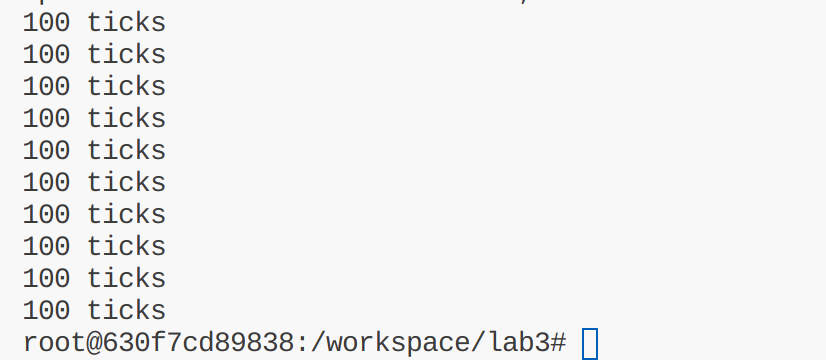
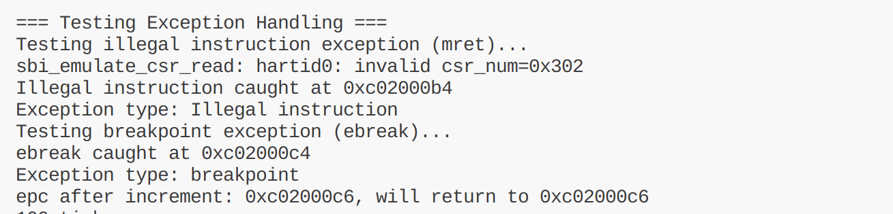

# 实验三：中断和中断处理流程

> 小组成员：谢雨婷 2311623 李天一 2314018 邓鑫 2313982

## 练习 1：完善中断处理 （需要编程）

请编程完善 trap.c 中的中断处理函数 trap，在对时钟中断进行处理的部分填写 kern/trap/trap.c 函数中处理时钟中断的部分，使操作系统每遇到 100 次时钟中断后，调用 print_ticks 子程序，向屏幕上打印一行文字"100 ticks"，在打印完 10 行后调用 sbi.h 中的 shut_down()函数关机。

要求完成问题 1 提出的相关函数实现，提交改进后的源代码包（可以编译执行），并在实验报告中简要说明实现过程和定时器中断中断处理的流程。实现要求的部分代码后，运行整个系统，大约每 1 秒会输出一次"100 ticks"，输出 10 行。

### 实现过程

在 `kern/trap/trap.c` 的 `interrupt_handler()` 函数中，针对 `IRQ_S_TIMER` 时钟中断进行了如下实现：

```122:143:trap.c
        case IRQ_S_TIMER:
            clock_set_next_event();//发生这次时钟中断，设置下一次时钟中断
            if(++ticks % TICK_NUM == 0){
                print_ticks();
                num++;
            }
            if(num==10){
                sbi_shutdown();
            }
            break;
```

关键实现点：

1. **设置下次时钟中断**：调用 `clock_set_next_event()`，通过 SBI 接口设置下次定时器中断
2. **计数器管理**：全局变量 `ticks`（在 `clock.c` 中定义）在每次中断时递增，`num` 记录打印次数
3. **周期性打印**：当 `ticks % TICK_NUM == 0`（即每 100 次中断）时调用 `print_ticks()` 打印"100 ticks"。`TICK_NUM` 定义为 100，对应每秒 100 次时钟中断
4. **关机处理**：打印 10 行后调用 `sbi_shutdown()` 正常关机

运行结果如下


### 定时器中断处理流程

1. **硬件触发阶段**：时钟硬件达到设定时间间隔，触发定时器中断请求（IRQ_S_TIMER）

2. **中断入口**：CPU 检测到中断后，跳转到 `__alltraps` 入口点

3. **保存上下文**（`trapentry.S`）：

   - 执行 `SAVE_ALL` 宏
   - 将当前 sp 保存到 sscratch，调整栈指针
   - 保存所有通用寄存器（x0-x31）和 CSR 寄存器（sstatus, sepc, stval, scause）到栈中

4. **调用处理函数**：

   - 将 trapframe 指针作为第一个参数传递
   - 调用 `trap()` 函数

5. **中断分发**（`trap.c`）：

   - `trap()` 调用 `trap_dispatch()` 进行分发
   - 根据 `tf->cause` 判断是中断还是异常

6. **中断处理**：

   - 调用 `interrupt_handler()` 处理中断
   - 对于时钟中断（`IRQ_S_TIMER`），执行时钟中断处理逻辑
   - 设置下次时钟中断、更新 ticks、判断是否需要打印和关机

7. **恢复上下文**（`trapentry.S:`）：
   - 返回到 `__trapret` 入口
   - 执行 `RESTORE_ALL` 宏恢复所有寄存器
   - 使用 `sret` 指令返回到被中断的代码继续执行

整个流程保证了中断的透明处理，被中断的程序可以无感知地继续执行，同时操作系统可以在中断处理中执行调度、时间管理等关键操作。

## 扩展练习 Challenge1：描述与理解中断流程

**回答：** 描述 ucore 中处理中断异常的流程（从异常的产生开始），其中 `mov a0, sp` 的目的是什么？SAVE_ALL 中寄存器保存在栈中的位置是什么确定的？对于任何中断，\_\_alltraps 中都需要保存所有寄存器吗？请说明理由。

### 1. ucore 中处理中断异常的完整流程

#### 阶段 1：异常产生

CPU 执行指令时检测到异常（如非法指令、断点）或接收到中断信号时，CPU 硬件自动保存当前执行状态到 CSR 寄存器：

- `sepc`：保存触发异常的指令地址
- `scause`：保存异常原因编号
- `sbadaddr`：保存错误地址（如缺页异常）
- `sstatus`：保存当前 CPU 状态（包括权限级别、中断使能等）

#### 阶段 2：异常向量跳转

CPU 读取 `stvec`（Supervisor Trap Vector）寄存器，获得异常入口地址 `__alltraps`，然后跳转到 `__alltraps` 开始执行。

#### 阶段 3：保存上下文（SAVE_ALL 宏）

```103:109:trapentry.S
    .globl __alltraps
    .align(2)
__alltraps:
    SAVE_ALL

    move  a0, sp
    jal trap
```

执行 `SAVE_ALL` 宏（`trapentry.S`），完成以下操作：

1. **保存当前 sp**：

   ```assembly
   csrw sscratch, sp    # 将 sp 暂存到 sscratch
   ```

2. **分配栈空间**：

   ```assembly
   addi sp, sp, -36 * REGBYTES  # 分配 36 * 8 = 288 字节栈空间
   ```

   用于存储 32 个通用寄存器 + 4 个 CSR 寄存器（sstatus, sepc, stval, scause）

3. **保存通用寄存器 x0-x31**：

   - 按顺序保存到栈中，偏移量为 `N * REGBYTES`（RISC-V 64 位：8 字节）

4. **读取并保存 CSR 寄存器**：

   ```assembly
   csrrw s0, sscratch, x0    # 交换：s0 = 原 sp，sscratch = 0
   csrr s1, sstatus          # 读取 sstatus
   csrr s2, sepc             # 读取 sepc
   csrr s3, stval            # 读取 stval
   csrr s4, scause           # 读取 scause

   STORE s0, 2*REGBYTES(sp)  # 保存原 sp 到 trapframe
   STORE s1, 32*REGBYTES(sp) # 保存 sstatus
   STORE s2, 33*REGBYTES(sp) # 保存 sepc
   STORE s3, 34*REGBYTES(sp) # 保存 stval (旧名 sbadaddr)
   STORE s4, 35*REGBYTES(sp) # 保存 scause
   ```

#### 阶段 4：调用处理函数

```assembly
    move  a0, sp
    jal trap
```

将 `sp`（指向保存的 trapframe）作为第一个参数 `a0` 传递给 `trap()` 函数，然后跳转到 C 语言编写的 `trap()` 函数。`move` 是 RISC-V 伪指令，等价于 `add a0, sp, x0`。

#### 阶段 5：中断/异常分发与处理

在 `trap()` 中调用 `trap_dispatch()`，根据 `tf->cause` 最高位判断是中断（负）还是异常（非负），然后调用 `interrupt_handler()` 或 `exception_handler()` 处理，最后执行相应处理逻辑。

#### 阶段 6：恢复上下文（RESTORE_ALL 宏）

```112:116:trapentry.S
__trapret:
    RESTORE_ALL
    # return from supervisor call
    sret
```

执行 `RESTORE_ALL` 宏（`trapentry.S:57-98`），从栈中恢复所有寄存器，然后使用 `sret` 指令返回到异常发生前的状态，继续执行。

### 2. `move a0, sp` 的目的

在 RISC-V 调用约定中，第一个参数通过 `a0` 传递。这行代码将 trapframe 地址传给 C 的 `trap(struct trapframe *tf)`，以便访问保存的寄存器与 CSR。`move` 指令是 RISC-V 伪指令，等价于 `add a0, sp, x0`，用于复制栈指针值。

### 3. SAVE_ALL 中寄存器保存位置

由 `struct trapframe` 的布局决定（`trap.h`）：

```41:47:trap.h
struct trapframe {
    struct pushregs gpr;
    uintptr_t status;
    uintptr_t epc;
    uintptr_t badvaddr;
    uintptr_t cause;
};****
```

`struct pushregs`按标准寄存器命名顺序定义各寄存器：`x0` (zero) 对应 `trap->gpr.zero`，`x1` (ra) 对应 `trap->gpr.ra`，`x2` (sp) 对应 `trap->gpr.sp`，……，`x31` 对应 `trap->gpr.t6`。

汇编中通过偏移量保存：

```assembly
STORE x0, 0*REGBYTES(sp)   # gpr.zero  在偏移量 0*8
STORE x1, 1*REGBYTES(sp)   # gpr.ra    在偏移量 1*8
STORE x2, 2*REGBYTES(sp)   # gpr.sp    在偏移量 2*8
...
STORE s1, 32*REGBYTES(sp)  # status   在偏移量 32*8（pushregs 之后）
STORE s2, 33*REGBYTES(sp)  # epc      在偏移量 33*8
...
```

这是编译时确定的结构体布局，与硬件 CSR 顺序匹配。

### 4. 是否所有中断都需要保存所有寄存器？

需要，原因如下：

1. 通用性：`__alltraps` 是统一入口，无法事前知道会触发哪种中断/异常，也无法静态确定哪些寄存器被修改。统一保存避免后续架构变化带来的遗漏。
2. 嵌套异常：处理中断/异常时可能再次触发异常。若只在处理阶段选择性保存，遇到嵌套时会丢失部分上下文。
3. 调试与一致性：全部保存后可完整打印调试信息（如 `print_trapframe()`、`print_regs()`），且保证每次恢复时能正确回到执行前状态。
4. 代价可控：RISC-V 寄存器数量适中，一次完整保存内存开销不大。

## 扩展练习 Challenge2：理解上下文切换机制

**回答：** 在 trapentry.S 中汇编代码 `csrw sscratch, sp`；`csrrw s0, sscratch, x0` 实现了什么操作，目的是什么？save all 里面保存了 stval scause 这些 csr，而在 restore all 里面却不还原它们？那这样 store 的意义何在呢？

### 1. `csrw sscratch, sp` 和 `csrrw s0, sscratch, x0` 的操作分析

#### 操作 1：`csrw sscratch, sp`

该指令将当前 `sp` 的值写入 `sscratch` 寄存器。

**目的**：

- 暂存异常发生时的栈指针值
- 防止在异常处理过程中修改 sp 导致无法恢复

#### 操作 2：`csrrw s0, sscratch, x0`

该指令同时执行交换：`s0 = sscratch`，并将 `x0`（零寄存器）写入 `sscratch`。

**等效操作**：

```c

s0 = sscratch;        // 保存原来的 sp（之前暂存的值）
sscratch = x0;       // 将 sscratch 清零
```

**目的**：

1. 恢复栈指针：将之前在 `sscratch` 中保存的 `sp` 值取回放到 `s0`，稍后保存到 trapframe 中
2. 标记异常来源：将 `sscratch` 清零表示当前在**内核**中执行异常处理
3. 支持嵌套异常检测：如果发生嵌套异常，`sscratch` 为 0 可以判断来自内核，`sscratch` 不为 0 则来自用户态

**整体流程**：

```c
// 异常发生时
csrw sscratch, sp      // sscratch = 异常时的 sp
addi sp, sp, -36*REGBYTES  // 分配栈空间
// ... 保存寄存器 ...
csrrw s0, sscratch, x0  // s0 = 原 sp，sscratch = 0
STORE s0, 2*REGBYTES(sp)  // 保存原 sp 到 trapframe
```

### 2. SAVE_ALL 中保存的 CSR 寄存器分析

在 SAVE_ALL 宏中保存了以下 CSR 寄存器：

```assembly
    # get sr, epc, badvaddr, cause
    # Set sscratch register to 0, so that if a recursive exception
    # occurs, the exception vector knows it came from the kernel
    csrrw s0, sscratch, x0
    csrr s1, sstatus
    csrr s2, sepc
    csrr s3, stval
    csrr s4, scause

    STORE s0, 2*REGBYTES(sp)
    STORE s1, 32*REGBYTES(sp)
    STORE s2, 33*REGBYTES(sp)
    STORE s3, 34*REGBYTES(sp)
    STORE s4, 35*REGBYTES(sp)
```

保存的 CSR 寄存器包括：

- `s0`：原 sp（从 sscratch 交换得到）
- `s1`：`sstatus`（CPU 状态寄存器）
- `s2`：`sepc`（异常发生时的 PC）
- `s3`：`stval`（错误地址，旧标准中称为 sbadaddr）
- `s4`：`scause`（异常原因）

### 3. RESTORE_ALL 中恢复的 CSR 寄存器

在 RESTORE_ALL 宏中只恢复了部分寄存器：

```assembly
    .macro RESTORE_ALL

    LOAD s1, 32*REGBYTES(sp)
    LOAD s2, 33*REGBYTES(sp)

    csrw sstatus, s1
     csrw sepc, s2
```

恢复的 CSR 寄存器包括：

- `sstatus`：恢复 CPU 状态
- `sepc`：恢复程序计数器

未恢复的 CSR 寄存器包括：

- `stval`（错误地址）
- `scause`（异常原因）
- `sp`（在最后单独恢复）

### 4. 为什么保存了却不恢复 stval 和 scause？

#### 根本原因：这些 CSR 的用途是只读的诊断信息

`stval`（旧标准中称为 sbadaddr）的用途包括：

- 记录异常相关的地址信息（如缺页异常的发生地址）
- 是**只读的硬件写入**寄存器，异常发生时由硬件自动填写
- **CPU 会自动清零或更新**，不需要软件恢复

`scause` 的用途包括：

- 记录异常原因编号（如非法指令、断点等）
- 同样是**只读的诊断信息**，由硬件在异常发生时自动填写
- 退出异常后硬件会自动清零或更新为新的异常信息，不需要软件恢复

#### Store 的意义何在？

**虽然不恢复，但保存仍然必要：**

1. 调试需求：在异常处理函数中可能需要查询这些信息

   - 例如打印异常类型、错误地址
   - 进行异常统计和诊断

2. 完整性：

   - 完整记录异常发生瞬间的 CPU 状态
   - 便于回溯调试

3. 架构一致性：
   - `struct trapframe` 包含所有可能需要的异常信息
   - 保持数据结构的完整性

### 总结

- `csrw sscratch, sp`：暂存原 sp，防止丢失
- `csrrw s0, sscratch, x0`：取回原 sp 到 s0，同时清零 sscratch 标记来自内核
- 保存但不恢复 `stval` 和 `scause`：它们是由硬件管理的只读诊断信息，不需要恢复，保存他们是为了中断异常处理软件调试、分析、打印。

## 扩展练习 Challenge3：完善异常中断

编程完善在触发一条非法指令异常 mret，在 kern/trap/trap.c 的异常处理函数中捕获，并对其进行处理，简单输出异常类型和异常指令触发地址，即"Illegal instruction caught at 0x(地址)"，"ebreak caught at 0x（地址）"与"Exception type: Illegal instruction"，"Exception type: breakpoint"。

### Challenge3 实现过程

在 `kern/trap/trap.c` 的 `exception_handler()` 函数中，完善了非法指令异常和断点异常的处理：

```c
        case CAUSE_ILLEGAL_INSTRUCTION:
             // 非法指令异常处理
            /*(1)输出指令异常类型（ Illegal instruction）
             *(2)输出异常指令地址
             *(3)更新 tf->epc寄存器
            */
            cprintf("Illegal instruction caught at 0x%08x\n", tf->epc);
            cprintf("Exception type: Illegal instruction\n");
            tf->epc += 4;  // 跳过非法指令（4字节）
            break;
        case CAUSE_BREAKPOINT:
            //断点异常处理
            /*(1)输出指令异常类型（ breakpoint）
             *(2)输出异常指令地址
             *(3)更新 tf->epc寄存器
            */
            cprintf("ebreak caught at 0x%08x\n", tf->epc);
            cprintf("Exception type: breakpoint\n");
            tf->epc += 2;  // 跳过断点指令（ebreak is 2 bytes）
            break;
```

**实现点：**

1. **非法指令异常处理**（CAUSE_ILLEGAL_INSTRUCTION）：

   - 输出异常触发地址：使用 `tf->epc` 获取异常指令的程序计数器值
   - 输出异常类型：打印 "Exception type: Illegal instruction"
   - 更新 epc 寄存器：执行 `tf->epc += 4` 跳过 4 字节的非法指令，确保返回时不会再次触发该异常

2. **断点异常处理**（CAUSE_BREAKPOINT）：

   - 输出断点地址：使用 `tf->epc` 获取断点指令的地址
   - 输出异常类型：打印 "Exception type: breakpoint"
   - 更新 epc 寄存器：执行 `tf->epc += 4` 跳过 4 字节的 ebreak 指令在实际测试中发现 ebreak 指令是 2 字节指令，而不是 4 字节。因此将 skip 修改为 `tf->epc += 2`

3. **异常触发测试代码**（在 `init.c` 中）：

   - 使用内联汇编 `asm volatile("mret")` 触发非法指令异常
   - 使用内联汇编 `asm volatile("ebreak")` 触发断点异常
   - 这些测试代码通过 `#ifdef CHALLENGE3_TEST` 控制编译

### 测试方法

在编译时定义 `CHALLENGE3_TEST`：

```bash
make clean
make DEFS=-DCHALLENGE3_TEST
```


运行后会在初始化阶段触发异常，验证异常捕获和处理正确工作。

## 总结

本实验通过完善 RISC-V 操作系统中的异常中断处理机制，深入理解了以下关键概念：

### 实验结果

1. **时钟中断处理**：成功实现了定时器中断的周期性处理，每 100 次中断输出一次状态信息，并在 10 次输出后正常关机。

2. **异常处理流程**：完整掌握了从异常产生到恢复的整个流程，包括上下文保存、异常分发、处理函数调用和上下文恢复。

3. **关键机制理解**：

   - `SAVE_ALL` 宏的设计和实现细节
   - RISC-V CSR 寄存器的使用和含义
   - `sscratch` 寄存器在异常处理中的重要作用
   - 异常返回时 CSR 寄存器的恢复策略

4. **异常处理增强**：实现了非法指令和断点异常的处理，包括正确的 EPC 更新机制。

### 技术要点

- **上下文切换**：通过 `sscratch` 保存原 `sp`，避免嵌套异常时丢失栈指针
- **寄存器恢复顺序**：必须在恢复 `x18`（`s2`）之前将 CSR 写回，防止寄存器别名冲突
- **异常类型识别**：通过 `scause` 的最高位判断中断（1）还是异常（0）
- **EPC 更新**：某些异常需要更新 EPC 跳过问题指令，避免无限循环
