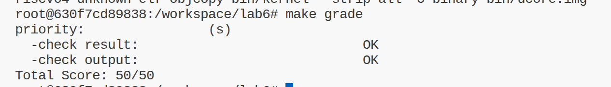
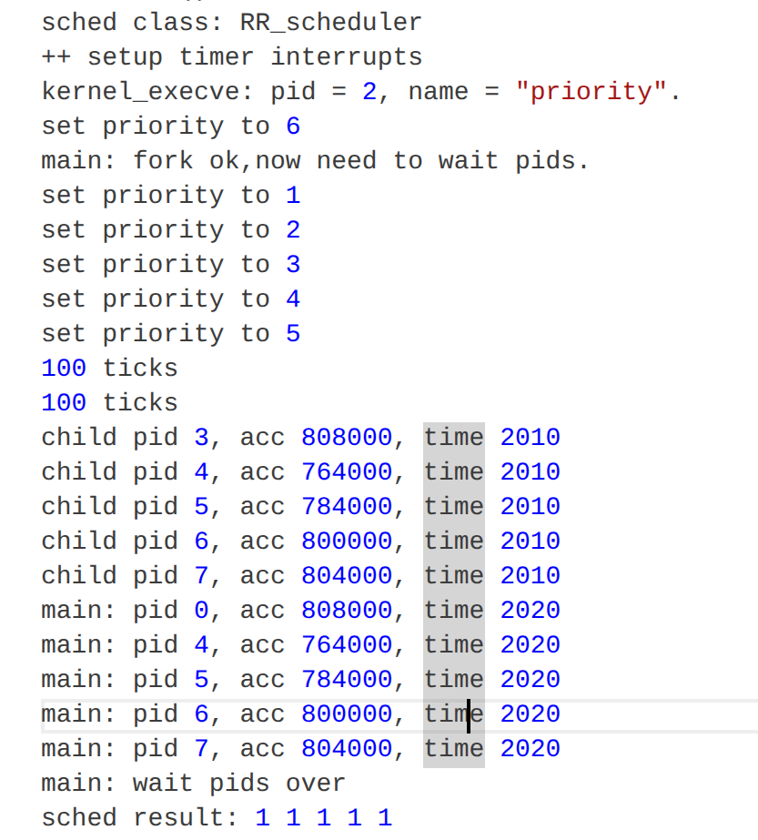

# 练习

## 练习 0：填写已有实验

本实验依赖实验 2/3/4/5。请把你做的实验 2/3/4/5 的代码填入本实验中代码中有“LAB2”/“LAB3”/“LAB4”“LAB5”的注释相应部分。并确保编译通过。 注意：为了能够正确执行 lab6 的测试应用程序，可能需对已完成的实验 2/3/4/5 的代码进行进一步改进。 由于我们在进程控制块中记录了一些和调度有关的信息，例如 Stride、优先级、时间片等等，因此我们需要对进程控制块的初始化进行更新，将调度有关的信息初始化。同时，由于时间片轮转的调度算法依赖于时钟中断，你可能也要对时钟中断的处理进行一定的更新。

1. lab2，将 best_fit_pmm[ch]搬到 lab6
2. lab3:更新，在时钟中断时调用调度器的 sched_class_proc_tick 函数
3. lab4&lab5: alloc_proc 的初始化设计；
4. lab5:load_icode 的更新

## 练习 1: 理解调度器框架的实现（不需要编码）

请仔细阅读和分析调度器框架的相关代码，特别是以下两个关键部分的实现：

### 1 调度器框架实现

#### 调度类结构体 sched_class 的分析

> 请详细解释 sched_class 结构体中每个函数指针的作用和调用时机，分析为什么需要将这些函数定义为函数指针，而不是直接实现函数。

1. `void (*init)(struct run_queue *rq)`;
   初始化就绪队列。调用时机：在调度器初始化时调用。
2. `void (*enqueue)(struct run_queue *rq, struct proc_struct *proc)`;
   把一个进程加入到就绪队列里。调用时机：在进程被唤醒时调用。

3. `void (*dequeue)(struct run_queue *rq, struct proc_struct *proc)`;
   把一个进程从就绪队列里移除。调用时机：在进程被调度时调用。
4. `struct proc_struct *(*pick_next)(struct run_queue *rq)`;
   选择下一个运行的进程。调用时机：在调度器选择下一个运行进程时调用。
5. `void (*proc_tick)(struct run_queue *rq, struct proc_struct *proc)`;
   处理时钟中断。调用时机：在时钟中断时调用。

将这些函数定义为函数指针是因为 调度类结构体它是一个抽象的结构体，它需要根据不同的调度算法实现不同的函数。如果直接实现函数，那么每次调度算法改变时，都需要修改调度类结构体的实现，这样会导致代码的耦合度很高，不利于维护。所以需要将这些函数定义为函数指针，这样每次调度算法改变时，只需要修改函数指针的实现，而不需要修改调度类结构体的实现。

#### 运行队列结构体 run_queue 的分析

> 比较 lab5 和 lab6 中 run_queue 结构体的差异，解释为什么 lab6 的 run_queue 需要支持两种数据结构（链表和斜堆）。

在 lab5 中，还没有抽象出 run_queue 结构体和调度类，调度器只是简单地在所有 PROC_RUNNABLE 进程之间做时间片轮转，不区分不同的调度策略，因此只需要“按顺序遍历进程”的能力，用隐含的链表（proc_list）就够了。

到了 lab6，调度框架被抽象为通用的 sched_class，而具体的调度算法有两种：

1. RR 调度：需要一个按插入顺序组织的队列，典型实现就是 run_list 这个双向链表，支持 O(1) 的入队/出队和顺序遍历。

2. stride 调度：需要按“当前 stride 值最小”的进程优先选取，适合用优先队列实现；实验里用的是斜堆（skew_heap_entry_t \*lab6_run_pool），可以在 O(log n) 时间内插入/删除、在 O(1) 时间内找到最小 stride 的进程。

因此，lab6 的 run_queue 里同时保留了 run_list（链表）：为 RR 等基于“队头/队尾顺序”的调度算法服务；和 lab6_run_pool（斜堆根指针）：为 stride 这类基于“最小键值”选取的调度算法服务。

统一放在同一个 run_queue 结构体里，配合不同的 sched_class（RR 用 run_list 字段，stride 用 lab6_run_pool 字段），既能复用一套调度框架接口（函数）,又能方便在同一内核中切换或扩展不同的调度策略。

#### 调度器框架函数分析

> 分析 sched_init()、wakeup_proc() 和 schedule() 函数在 lab6 中的实现变化，理解这些函数如何与具体的调度算法解耦。

### sched_init / wakeup_proc / schedule 在 Lab6 中的变化与解耦分析

在 Lab5 中，调度逻辑是“写死”的：

- 没有调度类和运行队列抽象，`schedule()` 直接在全局 `proc_list` 上按顺序查找下一个 `PROC_RUNNABLE` 进程；
- `wakeup_proc()` 只负责把进程状态改成 `PROC_RUNNABLE`，并不操作任何调度队列。  
  这种设计下，**调度策略（简单 RR）与 `schedule()` / `wakeup_proc()` 紧密耦合**，如果要换成其他调度算法，就只能直接改这些核心函数的内部实现。

到 Lab6，为了支持多种调度算法（RR 与 stride），内核引入了 `sched_class` 和 `run_queue` 两个关键抽象，从而将“调度框架”和“具体策略”解耦：

- 在 `sched.h` 中定义了统一的调度类接口 `struct sched_class`，包含 `init / enqueue / dequeue / pick_next / proc_tick` 等函数指针，表示“如何初始化队列、如何入队/出队、如何选择下一个进程、如何处理时钟中断”。
- 定义了统一的运行队列结构 `struct run_queue`，内部既包含链表 `run_list`（用于 RR），也包含斜堆根指针 `lab6_run_pool`（用于 stride）；具体用哪个字段由对应的调度类自己决定。

在这样的框架下：

- **`sched_init()`**  
  只负责选择当前使用的调度类并初始化运行队列：

  ```c
  sched_class = &default_sched_class;   // 选 RR 或 stride
  rq = &__rq;
  rq->max_time_slice = MAX_TIME_SLICE;
  sched_class->init(rq);
  ```

  它不再直接包含任何“遍历链表找下一个进程”的逻辑；更换调度算法只需修改这一行指针绑定即可。

- **`wakeup_proc()`**  
  仍然负责将进程从睡眠/其他状态切换到 `PROC_RUNNABLE`，但在 Lab6 中新增了一步：

  ```c
  if (proc->state != PROC_RUNNABLE) {
      proc->state = PROC_RUNNABLE;
      proc->wait_state = 0;
      if (proc != current) {
          sched_class->enqueue(rq, proc);
      }
  }
  ```

  也就是说，`wakeup_proc()` 只关心“**何时需要把进程放入就绪队列**”，至于**用什么数据结构、插在队列哪个位置**，完全交给当前的 `sched_class->enqueue` 实现，从而与具体算法解耦。

- **`schedule()`**  
  在 Lab6 中的逻辑变为：
  ```c
  current->need_resched = 0;
  if (current->state == PROC_RUNNABLE) {
      sched_class->enqueue(rq, current);   // 把当前进程丢回就绪队列
  }
  if ((next = sched_class->pick_next(rq)) != NULL) {
      sched_class->dequeue(rq, next);      // 从队列中取出下一个要运行的进程
  }
  if (next == NULL) {
      next = idleproc;
  }
  next->runs++;
  if (next != current) {
      proc_run(next);
  }
  ```
  `schedule()` 不再自己操心“按链表顺序轮转”还是“按最小 stride 选取”，而是**只负责：重置标志、把当前进程入队、调用调度类选出下一个进程并切换**。选人策略和队列操作完全委托给 `sched_class`。

综上，Lab6 通过 `sched_class` + `run_queue` 抽象，实现了：

- **调度框架（sched_init / wakeup_proc / schedule）与具体算法（RR / stride）的彻底解耦**；
- 在不修改这些核心入口函数的前提下，只需切换 `sched_class` 绑定，就可以更换底层调度策略和数据结构，大大提高了调度模块的可扩展性与可维护性。

### 2 调度器框架使用流程

#### 调度类的初始化流程

> 描述从内核启动到调度器初始化完成的完整流程，分析 default_sched_class 如何与调度器框架关联。

#### 1. 内核启动与基础环境初始化

1. **汇编入口 `entry.S`**

   - CPU 上电后首先跳入 `kern/init/entry.S`，完成基本的寄存器初始化、设置内核栈等工作，然后跳转到 C 语言入口 `kern_init`。

2. **C 入口 `kern/init/init.c::kern_init`**（你可以在该文件里看到具体调用顺序）：
   - 初始化控制台、物理内存管理（`pmm_init`）、分页机制（`boot_pgdir`）、内核动态内存分配（`kmalloc_init`）等基础子系统；
   - 初始化中断/异常处理：`idt_init()` 设置 `stvec` 指向 `__alltraps`，允许内核访问用户页（`set_csr(sstatus, SSTATUS_SUM)`）；
   - 初始化时钟中断：`clock_init()` 设置定时器，使得后面调度器可以通过时钟 tick 驱动进程切换；
   - 初始化进程管理：`proc_init()` 创建 `idleproc`（内核 idle 线程）和 `initproc`（运行 `init_main` 的内核线程）；
   - **初始化调度器**：调用 `sched_init()`，建立调度框架并绑定默认调度类；
   - 最后跳入 `cpu_idle()`，在空闲时循环检查 `current->need_resched`，需要时调用 `schedule()` 触发调度。

#### 2. 调度器初始化：`sched_init()` 的执行过程

在 `lab6/kern/schedule/sched.c` 中，`sched_init()` 的核心代码为：

```c
void sched_init(void)
{
    list_init(&timer_list);

    sched_class = &default_sched_class;      // 选择 RR 调度类

    rq = &__rq;
    rq->max_time_slice = MAX_TIME_SLICE;
    sched_class->init(rq);                   // 用当前调度类初始化 run_queue

    cprintf("sched class: %s\n", sched_class->name);
}
```

按步骤理解：

1. **初始化定时器链表**：`list_init(&timer_list);` 为将来可能的定时器事件留好数据结构。
2. **绑定默认调度类**：`sched_class = &default_sched_class;`
   - 这里选择了 RR 调度类（在 `default_sched.c` 中定义的 `default_sched_class`），也就是实验要求的时间片轮转调度。
3. **初始化运行队列 `run_queue`**：
   - 为全局运行队列分配存储 `__rq`，并设置最大时间片 `rq->max_time_slice = MAX_TIME_SLICE`；
   - 调用当前调度类的 `init` 钩子：`sched_class->init(rq);`。  
     对于 RR 调度，调用的是：
     ```c
     static void RR_init(struct run_queue *rq) {
         list_init(&(rq->run_list));
         rq->proc_num = 0;
     }
     ```
4. **输出当前调度类名**：`cprintf("sched class: %s\n", sched_class->name);`
   - 在 `default_sched_class` 中，`.name = "RR_scheduler"`，因此在 QEMU 输出中可以看到这一行，用于 `grade.sh` 判断当前是否在使用 RR 调度。

#### 3. default_sched_class 如何与调度器框架关联

`default_sched_class` 在 `default_sched.c` 中定义：

```c
struct sched_class default_sched_class = {
    .name = "RR_scheduler",
    .init = RR_init,
    .enqueue = RR_enqueue,
    .dequeue = RR_dequeue,
    .pick_next = RR_pick_next,
    .proc_tick = RR_proc_tick,
};
```

调度框架通过全局指针和包装函数与之解耦、关联：

- 在 `sched.c` 顶部有全局变量：

  ```c
  static struct sched_class *sched_class;
  static struct run_queue *rq;
  ```

- 并提供一组“中转函数”将核心调度点统一转发到当前 `sched_class`：

  ```c
  static inline void sched_class_enqueue(struct proc_struct *proc) {
      if (proc != idleproc) {
          sched_class->enqueue(rq, proc);
      }
  }

  static inline void sched_class_dequeue(struct proc_struct *proc) {
      sched_class->dequeue(rq, proc);
  }

  static inline struct proc_struct *sched_class_pick_next(void) {
      return sched_class->pick_next(rq);
  }

  void sched_class_proc_tick(struct proc_struct *proc) {
      if (proc != idleproc) {
          sched_class->proc_tick(rq, proc);
      } else {
          proc->need_resched = 1;
      }
  }
  ```

在后续的调度点，这些中转函数被统一使用：

- **`wakeup_proc()`** 中调用 `sched_class_enqueue(proc)` 把新就绪进程交给具体调度算法插入队列；
- **`schedule()`** 中：
  - 如果当前进程仍然可运行：`sched_class_enqueue(current);`；
  - 通过 `sched_class_pick_next()` 选择下一个要运行的进程；
  - 通过 `sched_class_dequeue(next)` 将其从队列中取出；
- **时钟中断处理 `interrupt_handler`** 中：
  - 在 `IRQ_S_TIMER` 分支调用 `sched_class_proc_tick(current);`，由具体调度类决定如何处理 time slice、何时设置 `proc->need_resched`。

> 这样，**`sched_init` 只负责“选类 + 初始化队列”，而调度框架（`wakeup_proc` / `schedule` / `sched_class_proc_tick`）只通过统一接口调用 `sched_class`，所有与“如何排队、如何选下一个进程”的细节都留在 `default_sched.c` 等具体调度类中实现**。
>
> 一旦后续需要切换到 `stride_sched_class`，只需在 `sched_init` 中改动 `sched_class = &stride_sched_class;`，其余代码无需修改，即可在同一框架下使用不同的调度算法。

#### 进程调度流程

> 绘制一个完整的进程调度流程图，包括：时钟中断触发、proc_tick 被调用、schedule() 函数执行、调度类各个函数的调用顺序。并解释 need_resched 标志位在调度过程中的作用
> **流程图**：

```txt
┌──────────────────────────────────────────────────────────────┐
│                 用户态：某个进程 current 正在运行                │
└──────────────────────────────────────────────────────────────┘
                               │
                               ▼
┌──────────────────────────────────────────────────────────────┐
│   硬件定时器到期，触发 S 模式时钟中断                             |
└──────────────────────────────────────────────────────────────┘
                               │
                               ▼
┌──────────────────────────────────────────────────────────────┐
│ __alltraps 保存寄存器 → 调用 C 函数 trap(tf)                    │
└──────────────────────────────────────────────────────────────┘
                               │
                               ▼
┌──────────────────────────────────────────────────────────────┐
│ trap(struct trapframe *tf)                                   │
│   if ((intptr_t)tf->cause < 0)                               │
│       // 中断                                                 │
│       trap_dispatch(tf);                                     │
│   else                                                       │
│       // 异常                                                 │
│       exception_handler(tf);                                 │
└──────────────────────────────────────────────────────────────┘
                               │
                               ▼
┌──────────────────────────────────────────────────────────────┐
│ trap_dispatch(tf) → interrupt_handler(tf)                    │
└──────────────────────────────────────────────────────────────┘
                               │
                               ▼
┌──────────────────────────────────────────────────────────────┐
│ interrupt_handler(struct trapframe *tf)                      │
│   switch (cause) {                                           │
│     ...                                                      │
│     case IRQ_S_TIMER:                                        │
│       clock_set_next_event();     // 设置下一次时钟中断         │
│       ticks++;                                               │
│       if (ticks % TICK_NUM == 0)                             │
│           print_ticks();                                     │
│       if (current != NULL)                                   │
│           sched_class_proc_tick(current);                    │
│       break;                                                 │
│     ...                                                      │
│   }                                                          │
└──────────────────────────────────────────────────────────────┘
                               │
                               ▼
┌──────────────────────────────────────────────────────────────┐
│ sched_class_proc_tick(struct proc_struct *proc)              │
│   if (proc != idleproc)                                      │
│       sched_class->proc_tick(rq, proc);  // 交给调度类         │
│   else                                                       │
│       proc->need_resched = 1;                                │
└──────────────────────────────────────────────────────────────┘
                               │
                               ▼
┌──────────────────────────────────────────────────────────────┐
│ 调度类的 proc_tick（  RR_scheduler ）                          │
│                                                              │
│ static void RR_proc_tick(struct run_queue *rq,               │
│                          struct proc_struct *proc) {         │
│     if (proc->time_slice > 0)                                │
│         proc->time_slice--;                                  │
│     if (proc->time_slice == 0) {                             │
│         proc->need_resched = 1;   // ★ 标记需要调度            │
│     }                                                        │
│ }                                                            │
└──────────────────────────────────────────────────────────────┘
                               │
                               ▼  （中断处理结束，返回 trap(tf) 继续）
┌──────────────────────────────────────────────────────────────┐
│ trap(struct trapframe *tf) 结尾部分                            │
│                                                              │
│   current->tf = otf;                                         │
│   if (!in_kernel) {            // 仅在从用户态陷入时            │
│       if (current->flags & PF_EXITING)                       │
│           do_exit(-E_KILLED);                                │
│       if (current->need_resched) {   // ★ 检查标志位           │
│           schedule();             // ★ 真正触发调度            │
│       }                                                      │
│   }                                                          │
└──────────────────────────────────────────────────────────────┘
                               │
                               ▼
┌──────────────────────────────────────────────────────────────┐
│ schedule()：调度框架本体                                       │
│                                                              │
│ void schedule(void) {                                        │
│   bool intr_flag;                                            │
│   struct proc_struct *next;                                  │
│   local_intr_save(intr_flag);                                │
│   {                                                          │
│       current->need_resched = 0;   // ★ 清除调度请求           │
│                                                              │
│       if (current->state == PROC_RUNNABLE) {                 │
│           // 当前进程仍可运行，放回就绪队列                       │
│           sched_class_enqueue(current);                      │
│           // 实际是：sched_class->enqueue(rq, current);       │
│       }                                                      │
│                                                              │
│       // 由调度类决定选择谁                                     │
│       if ((next = sched_class_pick_next()) != NULL) {        │
│           // 实际是：sched_class->pick_next(rq);              │
│           sched_class_dequeue(next);                         │
│           // 实际是：sched_class->dequeue(rq, next);          │
│       }                                                      │
│       if (next == NULL) {                                    │
│           next = idleproc;                                   │
│       }                                                      │
│       next->runs++;                                          │
│       if (next != current) {                                 │
│           proc_run(next);  // 切换地址空间 + 上下文             │
│       }                                                      │
│   }                                                          │
│   local_intr_restore(intr_flag);                             │
│ }                                                            │
└──────────────────────────────────────────────────────────────┘
                               │
                               ▼
┌──────────────────────────────────────────────────────────────┐
│ proc_run(next)：                                             │
│   - 切换 satp，加载 next 的页表（地址空间）                      |
│   - 调用 switch_to(prev->context, next->context) 切换上下文    │
│   - 从 next 的 trapframe 返回用户态继续执行                      |
└──────────────────────────────────────────────────────────────┘

```

**need_resched 标志位在调度过程中的作用**
每个进程的一个标志位，用来桥接调度决策和实际切换两个阶段，调度类的 proc_tick 在时钟中断时根据算法（时间片耗尽、stride 累积等）设置：当认为当前进程应当让出 CPU 时，设置 proc->need_resched = 1。：栈顶的 trap()每次从内核返回用户态前，检查当前进程：
若 need_resched == 1，则调用 schedule() 进行真正的进程切换；若为 0，则直接返回用户态，继续执行当前进程。将调度决策（在中断上下文中做）和实际上下文切换（在 trap() 的安全点执行）解耦，使整个调度过程更清晰、可控。

#### 调度算法的切换机制

> 分析如果要添加一个新的调度算法（如 stride），需要修改哪些代码？并解释为什么当前的设计使得切换调度算法变得容易。

1. `sched_class.c`中实现算法的 5 个接口。
2. 在 proc_struct 和 run_queue 中添加新的调度算法相关的字段。
3. 在调度框架初始化时选择新的调度算法，比如`sched_class=&stride_sched_class;`

---

当前 Lab6 的调度框架通过 sched_class 和 run_queue 做了良好的模块化和解耦，使“调度算法”与“调度时机与流程”分工明确：

1. 调度框架负责“什么时候调度、调用哪些钩子”：
   时钟中断发生时调用 sched_class_proc_tick(current)，由算法在 proc_tick 中设置 need_resched；
   trap() 在从内核返回用户态前检查 need_resched，需要时调用统一的 schedule()；
   schedule() 固定流程：
   若当前进程仍可运行，则 enqueue(current)；
   调用 pick_next() 选择下一个进程；
   调用 dequeue(next) 将其从队列中取出；
   最终 proc_run(next) 切换上下文。
2. 具体调度算法只负责“怎么排队、怎么选人”：
   通过实现自身的 init/enqueue/dequeue/pick_next/proc_tick，完全控制就绪队列的数据结构及策略（链表、斜堆、优先级计算等）；
   不需要关心时钟中断细节、trap 处理细节和上下文切换实现。
   因此，当需要添加或切换到一个新的调度算法时：
3. 不需要修改 wakeup_proc()、schedule()、trap() 等核心框架逻辑；
   只需：写一个新的 sched_class 实现（或完善 default_sched_stride.c），在 sched_init() 中切换 sched_class 指针，必要时小幅扩展 proc_struct / run_queue 的字段。

## 练习 2: 实现 Round Robin 调度算法（需要编码）

完成练习 0 后，建议大家比较一下（可用 kdiff3 等文件比较软件）个人完成的 lab5 和练习 0 完成后的刚修改的 lab6 之间的区别，分析了解 lab6 采用 RR 调度算法后的执行过程。理解调度器框架的工作原理后，请在此框架下实现时间片轮转（Round Robin）调度算法。

提示，请在实现时注意以下细节：

- 链表操作：list_add_before、list_add_after 等。
- 宏的使用：le2proc(le, member) 宏等。
- 边界条件处理：空队列的处理、进程时间片耗尽后的处理、空闲进程的处理等。

### 1 比较一个在 lab5 和 lab6 都有, 但是实现不同的函数, 说说为什么要做这个改动, 不做这个改动会出什么问题

- 提示: 如`kern/schedule/sched.c`里的函数。你也可以找个其他地方做了改动的函数。

```c lab5
// lab5 中 schedule 函数的实现
void schedule(void)
{
    bool intr_flag;
    list_entry_t *le, *last;
    struct proc_struct *next = NULL;
    local_intr_save(intr_flag);
    {
        current->need_resched = 0;
        last = (current == idleproc) ? &proc_list : &(current->list_link);
        le = last;
        do {
            if ((le = list_next(le)) != &proc_list) {
                next = le2proc(le, list_link);
                if (next->state == PROC_RUNNABLE) {
                    break;
                }
            }
        } while (le != last);
        if (next == NULL || next->state != PROC_RUNNABLE) {
            next = idleproc;
        }
        next->runs++;
        if (next != current) {
            proc_run(next);
        }
    }
    local_intr_restore(intr_flag);
}

```

该函数的特点：

1. 直接遍历全局 proc_list，从当前进程后面按顺序找下一个 PROC_RUNNABLE 的进程；
2. 调度策略（简单时间片轮转）写死在函数内部，没有调度类、没有 run_queue 抽象；
3. 如果要换成优先级调度、stride 调度等算法，必须修改这个函数本身。

```c lab6
// lab6 中 schedule 函数的实现
void schedule(void)
{
    bool intr_flag;
    struct proc_struct *next;
    local_intr_save(intr_flag);
    {
        current->need_resched = 0;

        if (current->state == PROC_RUNNABLE) {
            sched_class_enqueue(current);          // 入队
        }

        if ((next = sched_class_pick_next()) != NULL) {
            sched_class_dequeue(next);             // 出队
        }
        if (next == NULL) {
            next = idleproc;
        }
        next->runs++;
        if (next != current) {
            proc_run(next);                        // 切换
        }
    }
    local_intr_restore(intr_flag);
}
```

其中：
sched_class_enqueue / sched_class_pick_next / sched_class_dequeue 都是对当前调度类的间接调用：
sched_class->enqueue(rq, proc); sched_class->pick_next(rq); sched_class->dequeue(rq, proc);
真正的调度策略逻辑（比如 RR 的链表队列、stride 的斜堆和 lab6_stride 更新等）全部封装在 default_sched.c / default_sched_stride.c 等具体调度类中。

**为什么要做这个改动？**

1. Lab6 要支持不止一种调度算法（RR + stride），如果继续在 schedule() 中硬编码“遍历 proc_list 找下一进程”，就无法插入 stride 这样的新算法；
2. 引入 sched_class 和 run_queue 之后：
   schedule() 只负责“何时调度、调用哪些钩子”和“完成进程切换”，
   "如何组织就绪队列、如何选下一进程"完全交给不同的调度类实现。

**如果不做这个改动，会出现哪些具体问题？**

1. 调整/新增调度算法非常困难
   想实现 stride 调度，就必须重写 schedule() 里的遍历逻辑，把原来按链表轮转的代码改成基于 stride 的选择，不仅容易写错，还会把原本已经工作的 RR 逻辑一起打乱。
   不能做到 "只改一个新文件 + 切换一个指针" 就更换调度策略。
2. 调度逻辑难以扩展和测试
   所有调度策略揉在一个函数里，代码难以模块化测试，比如想单独测试 stride 的 enqueue/dequeue/pick 行为就很麻烦。
   实验后续如果再加入更多调度策略（如多级反馈队列、EDF），会让 schedule() 极度臃肿。
3. 时钟中断处理与调度策略耦合
   Lab6 中，时钟中断只调用 sched_class_proc_tick → sched_class->proc_tick()，由各算法决定何时置 need_resched；
   如果没有 sched_class 抽象，interrupt_handler 或 schedule() 里就不得不根据“当前使用哪种算法”写大量 if/else 分支，结构变复杂，也背离了“策略与机制分离”的设计目标。

### 2 描述你实现每个函数的具体思路和方法，解释为什么选择特定的链表操作方法。对每个实现函数的关键代码进行解释说明，并解释如何处理**边界情况**。

#### 1. `RR_init`：初始化运行队列

```c
static void
RR_init(struct run_queue *rq)
{
    // LAB6: 2311623
    list_init(&(rq->run_list));
    rq->proc_num=0;

}
```

- **思路与作用：**
  - `run_queue` 是调度器维护就绪进程的抽象结构，RR 算法只需要一个简单的 FIFO 队列，因此只初始化：
    - `run_list`：一个带哨兵的双向循环链表，用于按顺序挂接就绪进程；
    - `proc_num`：当前队列中的就绪进程数，用于统计和后续可能的负载均衡。
- **关键点：**
  - `list_init(&(rq->run_list));` 使用链表工具初始化头结点，使其 `next` 和 `prev` 都指向自己，表示“空队列”。
- **边界情况：**
  - 空队列时 `run_list.next == &run_list`，后续在 `RR_pick_next` / `RR_dequeue` 中会根据这个条件判断队列是否为空，避免访问空指针。

---

#### 2. `RR_enqueue`：将进程加入就绪队列

```c
static void
RR_enqueue(struct run_queue *rq, struct proc_struct *proc)
{
    // 双向链表：插到 run_list 前一个位置，相当于追加到队尾
    list_add_before(&(rq->run_list), &(proc->run_link));

    // 时间片处理：初次调度或剩余时间片不合理时重置为最大值
    if (proc->time_slice == 0 || proc->time_slice > rq->max_time_slice) {
        proc->time_slice = rq->max_time_slice;
    }
    // 记录该进程当前所在的 run_queue
    proc->rq = rq;
    // 就绪队列中的进程数 +1
    rq->proc_num++;
}
```

- **思路：**
  - 对于 RR，入队就是将进程放到队尾，确保公平轮转；
  - 同时为进程设置合适的 `time_slice`，保证每次被调度时都有一定的时间运行。
- **关键代码说明：**
  - `list_add_before(&rq->run_list, &proc->run_link);`
    - `run_list` 是一个“哨兵”结点，`list_add_before` 会将新结点插到哨兵之前，即**插到链表尾部**，实现 FIFO 队列。
  - `if (proc->time_slice == 0 || proc->time_slice > rq->max_time_slice)`
    - 初次入队或上次剩余时间片异常时，将 `time_slice` 重置为 `rq->max_time_slice`；
    - 若进程是从 CPU 上被抢占后重新入队（`time_slice` 可能还有剩余），就保留原来的剩余时间，实现时间片未用完不重置，保证更细粒度的公平性。
  - `proc->rq = rq;`
    - 通过反向指针记录“我属于哪个 run_queue”，方便后续 `dequeue` 和调度统计。
  - `rq->proc_num++`
    - 维护就绪队列长度，为调度器和可能的负载均衡逻辑提供依据（例如判断队列是否为空）。
- **边界情况：**
  - 如果队列原本为空，`run_list.next == &run_list`，`list_add_before` 也能正常工作，新结点会变成唯一元素，前后指针都指回 `run_list`，保证链表结构仍然正确。

---

#### 3. `RR_dequeue`：将进程从就绪队列移除

```c
static void
RR_dequeue(struct run_queue *rq, struct proc_struct *proc)
{
    // 从双向链表中移除该进程对应的节点
    list_del_init(&(proc->run_link));
    // 就绪队列中的进程数 -1
    rq->proc_num--;
}
```

- **思路：**
  - 从 run_queue 中删除给定的 `proc`，通常在该进程被选中运行或被显式唤醒/终止时调用。
- **关键代码说明：**
  - `list_del_init(&(proc->run_link));`
    - `list_del` 将该结点从链表中断开；
    - `list_init`（通过 `list_del_init`）把该结点的 `next/prev` 指回自身，避免后续误用时破坏链表结构。
- **边界情况：**
  - 如果误对已经不在链表中的结点再次调用 `RR_dequeue`，由于 `list_del_init` 会将指针重置为自环，能减少二次删除导致的崩溃风险（不过语义上仍然不应重复入/出队，需要上层逻辑保证）。

---

#### 4. `RR_pick_next`：选择下一个要运行的进程

```c
static struct proc_struct *
RR_pick_next(struct run_queue *rq)
{
    // 从队头选一个就绪进程
    list_entry_t *le = list_next(&rq->run_list);
    if (le != &(rq->run_list)) {
        return le2proc(le, run_link);   // 将链表节点还原为 proc_struct*
    }
    // 队列为空则返回 NULL，由调度器切换到 idleproc
    return NULL;
}
```

- **思路：**
  - RR 的“选人”策略：总是选择就绪队列中的第一个进程（队头），实现轮转。
- **关键代码说明：**
  - `list_next(&rq->run_list)` 得到的是队头元素（如果有的话）；
  - `if (le != &rq->run_list)` 用于判断队列是否为空（因为空队列时头结点的 `next` 仍指向自己）；
  - `le2proc(le, run_link)` 将链表节点指针转换回对应的 `struct proc_struct *`。
- **边界情况：**
  - 当 `run_list` 为空时，立即返回 `NULL`，由上层 `schedule()` 中的：
    ```c
    if (next == NULL) {
        next = idleproc;
    }
    ```
    兜底，确保不会对空指针调用 `proc_run`，也不会访问未初始化的进程结构。

---

#### 5. `RR_proc_tick`：处理时间片用尽的情况

```c
static void
RR_proc_tick(struct run_queue *rq, struct proc_struct *proc)
{
    // 时钟中断每触发一次，当前进程的 time_slice 减一
    if (proc->time_slice > 0) {
        proc->time_slice--;
    }
    // 时间片用完，标记需要调度
    if (proc->time_slice == 0) {
        proc->need_resched = 1;
    }
}
```

- **思路：**
  - 在每次时钟中断时调整当前进程的剩余时间片，当其用完时通过 `need_resched` 向调度器发出“需要换人”的信号。
- **关键代码说明：**
  - `if (proc->time_slice > 0) proc->time_slice--;`
    - 避免在 `time_slice` 已经为 0 时继续减到负数；
  - 当 `time_slice` 减到 0 时，将 `proc->need_resched` 置为 1：
    - `need_resched` 不会立即触发切换，而是由 `trap()` 在从内核返回用户态前检查：
      ```c
      if (!in_kernel && current->need_resched)
          schedule();
      ```
    - 这样实现了“调度决策”（在中断上下文内）与“执行切换”（在安全的 trap 返回点）之间的解耦。
- **边界情况：**
  - `RR_proc_tick()` 只对非 `idleproc` 执行（由 `sched_class_proc_tick` 过滤），避免无意义地对空转线程消耗时间片；
  - 当 `time_slice` 初始为 0 时，通过 `RR_enqueue` 重置为 `max_time_slice`，确保不会出现“刚被调度上来就立刻被抢占”的异常情况。

### 3 展示 make grade 的**输出结果**，并描述在 QEMU 中观察到的调度现象。

输出结果：

调度现象：
描述:每个子进程在有限时间内不断自旋累加 acc[i]，超时后退出并打印自己的运行结果：父进程在依次 waitpid 收割这些子进程，并打印每个子进程的最终计数： sched result: 1 1 1 1 1 表示：
所有子进程获得的 CPU 时间（通过 acc[i] 近似）几乎相同，比例都是 1。也就是说，RR 调度完全忽略了优先级，平等地为每个就绪进程分配时间片。

### 4 分析 Round Robin 调度算法的优缺点，讨论如何调整时间片大小来优化系统性能，并解释为什么需要在 RR_proc_tick 中设置 need_resched 标志。

#### 优点

- **简单公平**：按就绪队列顺序轮转，所有可运行进程都能获得 CPU；实现简单，开销低。
- **响应性好**：时间片到期就切换，避免某个进程长期占用 CPU，对交互式或短作业较友好。
- **无饥饿**：只要进程在就绪队列中，就会周期性被调度，不会被完全饿死。

#### 缺点

- **忽略优先级**：基础 RR 不区分权重/优先级，所有进程被一视同仁，无法体现“谁更重要”。
- **上下文切换开销**：时间片过短会导致频繁切换，浪费 CPU 在上下文保存/恢复上；过长则响应变差。
- **无法区分 CPU-bound / I/O-bound**：对 I/O 密集型进程友好，但对需要长时间计算的进程，短时间片会增加不必要的切换开销。

#### 时间片大小的调整策略

- **太小（短时间片）**：上下文切换频繁，吞吐量下降；但响应延迟小，交互体验好。
- **太大（长时间片）**：切换开销低，吞吐量较好；但响应时间变长，交互进程体验差。
- **折中选择**：实际系统会根据 CPU 速度、进程数、工作负载类型（交互式 vs. 批处理）调整时间片：
  - 交互场景倾向更短的时间片以降低感知延迟；
  - 计算密集或批处理场景倾向稍长的时间片减少切换开销。
- **实验里的实践**：`MAX_TIME_SLICE` 作为统一上限，`RR_enqueue` 在入队时重置或保留剩余时间片，确保每次调度至少有一个合理的运行窗口。

#### 为什么在 `RR_proc_tick` 中设置 `need_resched`

- **职责分离**：时钟中断 (`IRQ_S_TIMER`) 只做“计数 + 通知调度器当前进程走了一拍”，真正的调度决策由 `proc_tick` 中的算法（此处是 RR）决定；
- **安全的切换时机**：在中断上下文中直接 `switch_to` 不安全且复杂，通过设置 `proc->need_resched = 1`，将“应该换人”的信号传递给 `trap()`，由它在从内核返回用户态前的安全点调用 `schedule()` 完成切换；
- **防止重复切换**：`schedule()` 开始时会清空 `current->need_resched`，避免同一调度请求被重复处理；下一次时钟中断再根据条件重新置位，形成新的调度周期。  
  简而言之，`need_resched` 充当了从“算法判定要换人”到“实际执行上下文切换”之间的桥梁，既保证调度决策的及时性，又保证切换动作的安全性和可控性。

### 5 **拓展思考**：如果要实现优先级 RR 调度，你的代码需要如何修改？当前的实现是否支持多核调度？如果不支持，需要如何改进？
